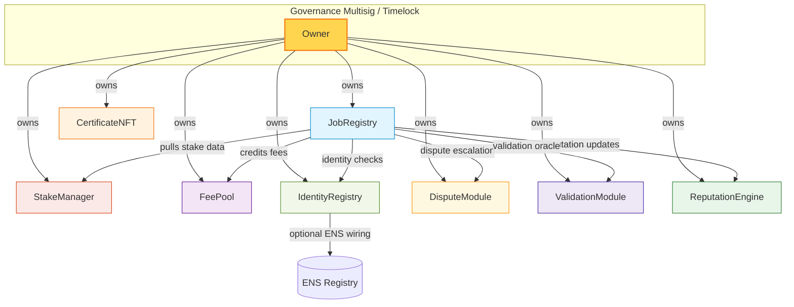
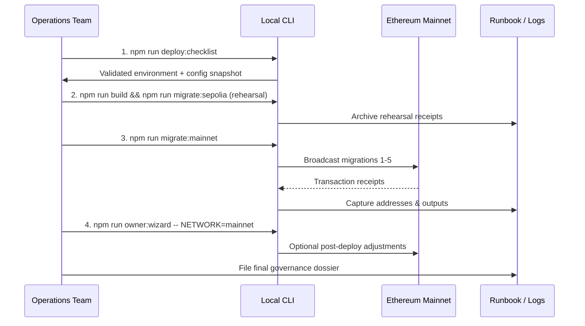
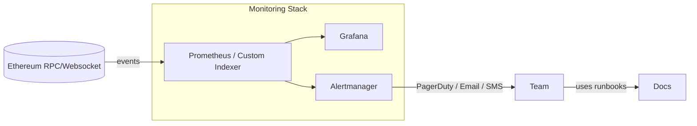

# Ethereum Mainnet Deployment Playbook (Truffle)

This playbook walks a non-technical operator through preparing, rehearsing, and executing a
production deployment of the AGIJobs v1 protocol on Ethereum Mainnet using Truffle. The flow is
designed to be checklist-driven so that each step is auditable and repeatable by compliance teams.

> **TL;DR** – run `npm run deploy:checklist`, rehearse on Sepolia, then execute `npm run migrate:mainnet`
> once every preflight item is green.

## 0. Visual map of the protocol

Understanding how contracts relate to each other dramatically simplifies pre-deployment reviews and
incident response. The diagram below highlights the production topology after the migrations finish.



## Deployment flywheel at a glance



## 1. Prerequisites

| Requirement | Why it matters |
| --- | --- |
| Node.js 18+ and npm | Matches the versions used in CI and local testing. |
| Git + the `main` branch of this repository | Ensures you are using the audited release. |
| A secure workstation with hardware wallet access | The mnemonic controls protocol ownership. |
| Access to an Ethereum Mainnet RPC (Infura, Alchemy, QuickNode…) | Required for Truffle migrations. |
| A governance multisig address (Gnosis Safe recommended) | Receives contract ownership at the end of the run. |
| Optional timelock/operations contract | Grants day-to-day control if desired. |
| ENS operator access (only when ENS integration is enabled) | Allows updating ENS name wrappers. |
| ETH and AGI Alpha tokens in the deployer wallet | Covers gas fees and seed liquidity for rehearsals. |

### Files to review and customize

All configuration lives in JSON files under `config/`. Think of these files as the single source of
truth that back every migration and owner script:

* `config/agialpha.mainnet.json` – staking token address, decimals, burn address, metadata.
* `config/ens.mainnet.json` – ENS registry + name wrapper addresses and root namehashes.
* `config/registrar.mainnet.json` – ENS registrar wiring (optional, used when ENS is enabled).
* `config/params.json` – protocol timings, quorum thresholds, fees, and slashing settings shared
  across networks.

The repository ships with canonical production defaults. Only change these values with
multi-stakeholder approval and re-run the validation script after every edit. The checklist command
prints the active configuration so the entire operations team can visually diff any changes before
sign-off.

## 2. Prepare the environment

1. Copy `.env.example` to `.env` (or export variables directly in the shell).
2. Populate at minimum:
   ```ini
   MNEMONIC="twelve word seed phrase stored in password manager"
   RPC_MAINNET="https://mainnet.infura.io/v3/<project-id>"
   GOV_SAFE="0xMultisigAddress"
   ETHERSCAN_API_KEY="<api key for verification>"
   ```
3. Optional but strongly encouraged:
   ```ini
   RPC_SEPOLIA="https://sepolia.infura.io/v3/<project-id>"
   TIMELOCK_ADDR="0xOperationsTimelock"
   ```
4. Never paste the mnemonic in plain text terminals. Use a secure shell with history disabled or
   rely on environment managers such as `direnv`. Hardware wallets are strongly recommended for the
   production broadcast step.

> **Tip:** run `npm run diagnose` at any point to print RPC reachability, ENS settings, configured
> networks, and contract wiring diagnostics without touching the blockchain.

## 3. Run the automated preflight checklist

From the repository root:

```bash
npm install
npm run deploy:checklist
```

The checklist performs three things:

1. Verifies all mandatory environment variables are present and well-formed.
2. Prints a snapshot of the mainnet configuration files for an additional human check.
3. Executes `scripts/validate-config.js` against the selected network (defaults to mainnet).

Resolve any red ✖ markers before moving forward. You can pass another variant (e.g. `dev` or
`sepolia`) to rehearse with test parameters:

```bash
npm run deploy:checklist -- sepolia
```

If anything fails, the script exits with a non-zero status so CI/CD pipelines can gate releases
automatically. Capture the full console output in your deployment dossier.

## 4. Compile and rehearse on Sepolia (recommended)

1. `npm run build`
2. `npm run migrate:sepolia`
3. `npm run wire:verify -- NETWORK=sepolia`
4. `npm run owner:wizard -- NETWORK=sepolia`

Document every transaction hash and keep the output in the deployment dossier. This dry run serves
as the formal dress rehearsal and lets the owner practice the governance tooling.

## 5. Execute the mainnet deployment

With all rehearsals complete and approvals in place:

| Step | Command | Purpose |
| --- | --- | --- |
| 1 | `npm run deploy:checklist` | Ensure env + configs are still valid. |
| 2 | `npm run build` | Produce Solidity artifacts using the audited compiler version. |
| 3 | `npm run migrate:mainnet` | Broadcast the full migration suite to Ethereum. |
| 4 | `npm run wire:verify -- NETWORK=mainnet` | Confirm wiring matches config/params.json. |
| 5 | `npm run owner:wizard -- NETWORK=mainnet` | Review ownership + optionally adjust parameters. |

Truffle will execute the migrations in order:

1. `0_local_sim_setup.js` – no-op on mainnet.
2. `1_initial_migration.js` – records the deployment and is idempotent.
3. `2_deploy_protocol.js` – deploys all core contracts. Uses the staking token address from
   `agialpha.mainnet.json`.
4. `3_wire_protocol.js` – connects modules, wires fee recipients, sets timings and thresholds from
   `params.json`.
5. `4_configure_ens_and_params.js` – optionally integrates ENS when hashes are provided.
6. `5_transfer_ownership.js` – hands ownership to the `GOV_SAFE` address and optional timelock.

Every migration emits clear console logs. Save them in the deployment dossier alongside the final
`build/contracts/*.json` artifacts.

> **Operational reminder:** When the deployment completes, immediately export the resulting
> addresses via `npm run export:artifacts NETWORK=mainnet` and circulate them to downstream teams
> (frontend, analytics, monitoring) so there is no lag in switching from rehearsal infrastructure to
> production endpoints.

## 6. Post-deployment tasks

1. **Verify sources** – `npm run verify:mainnet`
2. **Publish ABI bundle** – `npm run export:artifacts NETWORK=mainnet`
3. **Record governance metadata** – persist the addresses from `artifacts-public/<network>.json`.
4. **Enable monitoring** – point alerting at the deployed addresses and track fee pool balances.
5. **Run job owner controls** – if any jobs existed during migration, extend or finalize them using
   `npm run owner:wizard`.
6. **Back up** – archive the `.env` file, deployment outputs, and governance approvals in secure
   storage.

### Recommended observability wiring



Set up alerts for:

- `JobRegistry` paused state changes or dispute spikes.
- `StakeManager` total staked balance deviations.
- `FeePool` accumulated fees and burn address withdrawals.
- ENS configuration drifts (poll via `npm run wire:verify`).

## 7. Operational control surface (owner capabilities)

The protocol is designed so the owner (multisig) can safely update or recover every critical
parameter:

| Contract | Key functions | Purpose |
| --- | --- | --- |
| `JobRegistry` | `setFullConfiguration`, `setModules`, `updateModule` | Swap Identity/Stake/Fee/Dispute modules or update the entire wiring in a single transaction. |
| | `setTimings`, `updateTiming`, `extendJobDeadlines` | Tune lifecycle windows globally or per job. |
| | `setThresholds`, `updateThreshold` | Adjust quorum, fees, slashing and approval thresholds. |
| | `finalizeJob`, `raiseDispute`, `resolveDispute`, `timeoutJob` | Manage live jobs, disputes, and escalations. |
| `StakeManager` | `updateJobRegistry`, `setFeeRecipient`, `emergencyRelease` | Migrate registries, rotate fee recipients, or recover user funds. |
| `FeePool` | `updateJobRegistry`, `withdrawFees`, `updateBurnAddress` | Redirect fee routing, evacuate pooled fees, or rotate the burn sink. |
| `IdentityRegistry` | `configureEns`, `setEnsRegistry`, `setEnsNameWrapper`, `setIdentityAdmin` | Maintain identity proofs and ENS integration. |
| `ReputationEngine` | `setJobRegistry`, `setEvaluator`, `batchAdjustReputation` | Maintain trust signals and respond to disputes. |
| `DisputeModule` | `setJobRegistry`, `setArbiter`, `setSlashBps` | Update dispute authority and penalties. |
| `ValidationModule` | `setJobRegistry`, `setValidator`, `setApprovalThreshold` | Adjust validation logic and quorum requirements. |

Use the pre-built wizards for guided execution:

```bash
npm run owner:wizard -- NETWORK=mainnet
npm run owner:console -- NETWORK=mainnet
npm run config:wizard -- NETWORK=mainnet
```

These scripts present human-readable menus, confirm the expected state, and only submit a
transaction after explicit confirmation. They are safe to run in read-only mode (`--interactive=false`)
for audits.

## 8. Incident response and recovery

* **Pause the system:** `JobRegistry.pause()` and `StakeManager.pause()` (via the owner console).
* **Emergency release of stake:** `StakeManager.emergencyRelease()` for affected accounts.
* **Swap compromised modules:** Deploy a fresh module and call `JobRegistry.updateModule`.
* **Restore ENS:** Re-run `npm run configure:registry -- NETWORK=mainnet` after updating the ENS
  configuration files.

Always document the incident timeline, transactions, and the root-cause analysis for stakeholders.

## 9. Compliance checklist

* ✅ Deployment dossier stored in secure knowledge base.
* ✅ Multisig signers acknowledge receipt of ownership and timelock permissions.
* ✅ Monitoring alerts configured for stake balances, fee pool balances, and JobRegistry pauses.
* ✅ ENS records updated and verified (if applicable).
* ✅ Incident response runbook reviewed quarterly.
* ✅ Owner console scripts rehearsed quarterly to ensure institutional muscle memory.

Following this playbook ensures that even a non-technical operations team can execute a safe,
repeatable, and auditable mainnet deployment.
