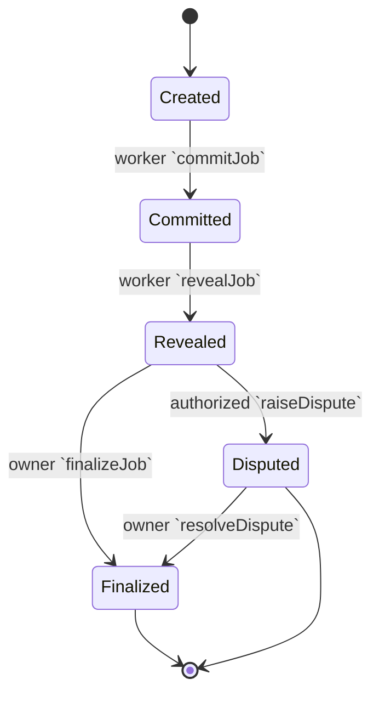

# Job Lifecycle Overview

The protocol drives work through a commit–reveal pipeline that coordinates the worker, validator committee, and dispute process. Jobs are created on `JobRegistry` and flow through a set of terminal states controlled by both the registry and the `ValidationModule`.



## Lifecycle Phases

1. **Post (Created)** – Clients open a job by calling `createJob`, locking the stake requirement and establishing lifecycle deadlines using the configured `commitWindow`, `revealWindow`, and `disputeWindow`.
2. **Apply (Committed)** – A worker commits to the job by hashing a secret with `commitJob`. The worker must commit before the `commitDeadline` expires.
3. **Worker Reveal (Revealed)** – After completion, the worker reveals the secret with `revealJob`. This must occur before the `revealDeadline`.
4. **Validator Commit** – Validators stake their position by calling `ValidationModule.commitValidation(jobId, commitment)`. Commitments are one-per validator per job, salted, and bound to the chain via:
   ```solidity
   keccak256(abi.encodePacked(
       COMMIT_NS,
       block.chainid,
       jobId,
       validator,
       approved,
       salt
   ))
   ```
   The namespace constant prevents cross-protocol collisions while `block.chainid` guarantees cross-network replay protection.
5. **Validator Reveal** – Validators publish their vote with `revealValidation(jobId, approved, salt)`. The module records the vote, increments the approval/rejection counters, and clears the stored commitment.
6. **Finalize Delay & Settlement** – `JobRegistry.finalizeJob` can only succeed once:
   - the job is in the `Revealed` state;
   - every validator commitment has been revealed (`pendingCommitCount(jobId) == 0`);
   - the job has not already been finalized or disputed.
   This implicit waiting period functions as the protocol's `finalizeDelay`, allowing validators to finish revealing before the owner settles the job.
7. **Dispute Path** – Authorized identities can call `raiseDispute` during the commit or reveal windows. The validation module enforces:
   - only one active dispute per job (`beforeDispute` reverts on repeats);
   - all pending validator commits must be resolved before `resolveDispute` completes; and
   - each dispute can only be resolved once (`beforeDisputeResolution` sets the terminal flag).

## Timing Parameters

| Parameter | Purpose | Enforcement |
|-----------|---------|-------------|
| `commitWindow` | Duration from job creation to the worker commit deadline. | `commitDeadline = createdAt + commitWindow`; committing after the deadline triggers `WindowExpired("commit")`. |
| `revealWindow` | Time allotted to the worker to reveal their commit. | `revealDeadline = commitDeadline + revealWindow`; missing the deadline triggers `WindowExpired("reveal")`. |
| `disputeWindow` | Period during which disputes may be raised. | `disputeDeadline = revealDeadline + disputeWindow`; `raiseDispute` reverts once the deadline passes. |
| `finalizeDelay` | Implicit waiting period allowing validators to reveal before settlement. | Realized by `ValidationModule.beforeFinalize` which reverts while `pendingCommitCount(jobId) > 0` or the job is already finalized. |

## Invariants & Events

* **Single Commit per Validator/Job** – `commitValidation` stores commitments in `commitOf[jobId][validator]` and rejects duplicates with `ValidationCommitExists`.
* **Reveal Requires Prior Commit** – `revealValidation` checks the stored commitment and fails with `ValidationCommitMissing` or `ValidationCommitMismatch`.
* **No Double Finalization** – `beforeFinalize` and `beforeDisputeResolution` set an internal `_finalized` flag, causing subsequent finalize or dispute actions to revert with `ValidationJobClosed`.
* **Disputes Resolved Once** – `beforeDispute`/`beforeDisputeResolution` toggle `_disputeActive` ensuring only a single raise/resolve cycle per job.

Key events emitted during the lifecycle:

- `ValidationCommitted(jobId, validator, commitHash)` – validator commitment accepted.
- `ValidationRevealed(jobId, validator, approved, salt)` – validator vote recorded.
- `JobFinalized(jobId, success, feeAmount)` – stake settled after all validations revealed.
- `JobDisputed(jobId, raiser)` / `DisputeResolved(jobId, slashed, slashAmount)` – dispute path markers.

Together, `JobRegistry` and `ValidationModule` enforce a deterministic state machine that prevents premature settlement, guarantees that validator votes are revealed before resolution, and ensures that each job reaches exactly one terminal state.
